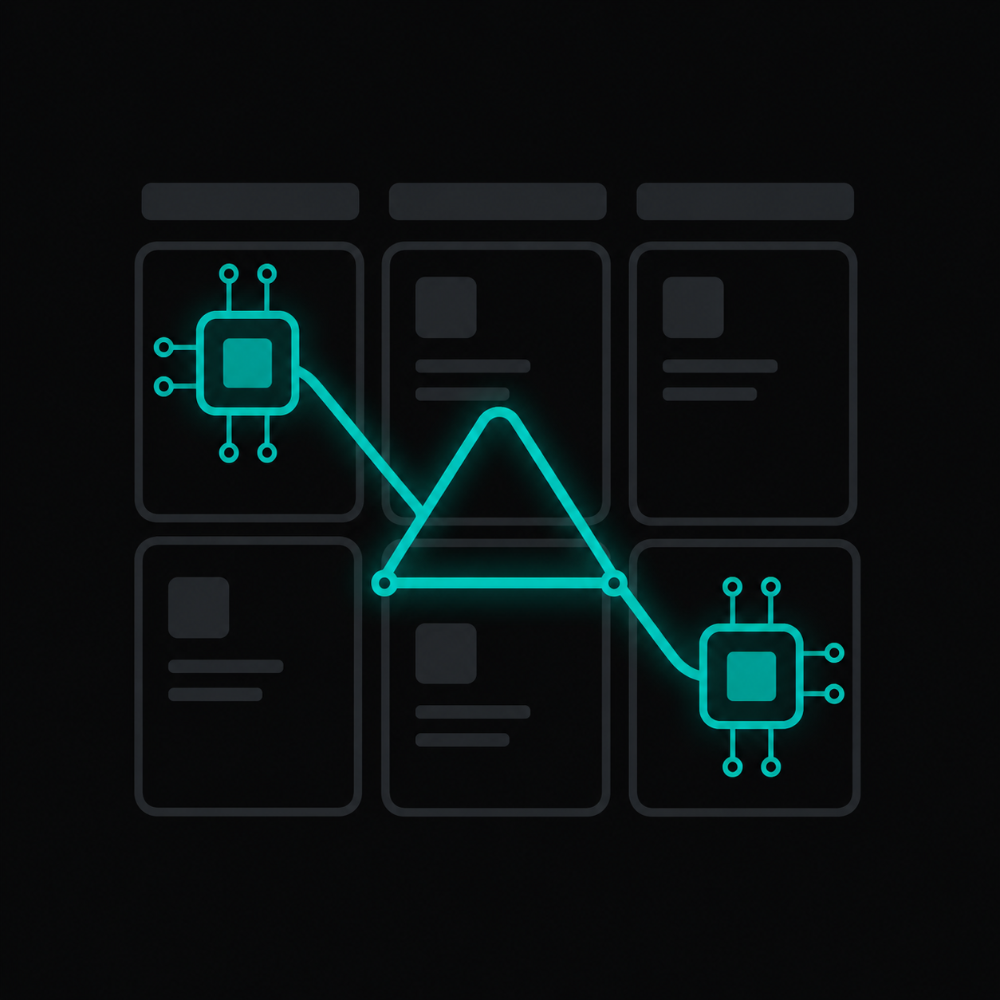

# acpKanban

<p align="center">
  
</p>

<p align="center">
  <a href="README.md"><strong>English</strong></a> | <strong>中文</strong>
</p>

<p align="center">
  
  
  
  
</p>

---

- [简介](#-简介)
- [核心特性](#-核心特性)
- [项目状态](#-项目状态)
- [支持的 ACP Agent](#-支持-acp-agent-client-protocol-的-agent)
- [系统架构](#-系统架构)
- [快速开始](#-快速开始)
- [配置说明](#-配置说明)
- [开发指南](#-开发指南)
- [常见问题](#-常见问题)
- [相关资源](#-相关资源)
- [License](#-license)

---

## 📖 简介

**acpKanban** 是一个将 ACP Agent 直接集成到工作流的看板任务管理系统。主要用于：

- **汇总碎片化的 session** — 在一个界面看到各个任务的进度
- **使用多个不同的 agent** — 不同任务、不同 agent、不同免费额度
- **体验不同厂商** — 不同厂商的 system prompt + loop + harness
- **任务编排** — 卡片移动到配置了 agent 的列时自动执行

## ✨ 核心特性

- 🔄 **实时双向通信** — Flutter App ⇄ Bridge ⇄ ACP Agent
- 🔐 **端到端加密** — E2EE (X25519 + AES-256-GCM)，数据私有安全
- 🌐 **三级连接策略** — mDNS → 云中继 (Relay) → 云端 SaaS，智能降级
- 🤖 **多 Agent 支持** — Gemini CLI、Qwen Code、OpenClaw、Cline CLI 等 30+
- 📋 **卡片级会话隔离** — 每个卡片独立 Session，跨卡片可关联
- 🔍 **混合检索** — SQLite FTS5 + sqlite-vec 语义搜索
- 🎨 **可视化列管理** — 拖拽排序、自定义列名和颜色
- ⏱️ **项目 Roadmap** — 聚合所有卡片事件的全局视图
- 📄 **AG-UI 协议集成** — 结构化消息渲染、工具调用状态胶囊、推理过程折叠展示

## 📌 项目状态

| 模块 | 状态 | 说明 |
|------|------|------|
| 看板 CRUD | ✅ 完成 | 卡片/列/项目的基础增删改查 |
| 多 Agent 连接 | ✅ 完成 | 支持 30+ ACP Agent 的接入 |
| AG-UI 渲染 | ✅ 完成 | 结构化消息、工具调用、推理过程展示 |
| E2EE 加密 | ✅ 完成 | X25519 + AES-256-GCM |
| 三级连接 (mDNS/Relay/Cloud) | ✅ 完成 | 智能降级策略 |
| 混合检索 | ✅ 完成 | FTS5 + 语义搜索 |
| A2A 协议集成 | 🚧 规划中 | Agent 注册、发现及任务编排 |
| 卡片自动执行 | 🚧 规划中 | 卡片移到指定列时自动触发 Agent |

## 🤖 支持 ACP（Agent Client Protocol）的 Agent

* [AgentPool](https://phil65.github.io/agentpool/advanced/acp-integration/)
* [Augment Code](https://docs.augmentcode.com/cli/acp)
* [AutoDev](https://github.com/phodal/auto-dev)
* [Blackbox AI](https://docs.blackbox.ai/features/blackbox-cli/introduction)
* [Claude Agent](https://platform.claude.com/docs/en/agent-sdk/overview) (via [Zed's SDK adapter](https://github.com/zed-industries/claude-agent-acp))
* [Cline](https://cline.bot/)
* [Codex CLI](https://developers.openai.com/codex/cli) (via [Zed's adapter](https://github.com/zed-industries/codex-acp))
* [Code Assistant](https://github.com/stippi/code-assistant?tab=readme-ov-file#configuration)
* [crow-cli](https://crow-ai.dev)
* [Cursor](https://cursor.com/docs/cli/acp)
* [Docker's cagent](https://github.com/docker/cagent)
* [fast-agent](https://fast-agent.ai/acp)
* [Factory Droid](https://factory.ai/)
* [fount](https://github.com/steve02081504/fount)
* [Gemini CLI](https://github.com/google-gemini/gemini-cli)
* [GitHub Copilot](https://github.com/features/copilot) ([public preview](https://github.blog/changelog/2026-01-28-acp-support-in-copilot-cli-is-now-in-public-preview/))
* [Goose](https://block.github.io/goose/docs/guides/acp-clients)
* [Hermes Agent](https://hermes-agent.nousresearch.com/docs/user-guide/features/acp)
* [Junie by JetBrains](https://junie.jetbrains.com/)
* [Kimi CLI](https://github.com/MoonshotAI/kimi-cli)
* [Kiro CLI](https://kiro.dev/docs/cli/acp/)
* [Minion Code](https://github.com/femto/minion-code)
* [Mistral Vibe](https://github.com/mistralai/mistral-vibe)
* [OpenClaw](https://docs.openclaw.ai/cli/acp)
* [OpenCode](https://github.com/sst/opencode)
* [OpenHands](https://docs.openhands.dev/openhands/usage/run-openhands/acp)
* [Pi](https://github.com/badlogic/pi-mono/tree/main/packages/coding-agent) (via [pi-acp adapter](https://github.com/svkozak/pi-acp))
* [Poolside](https://github.com/poolsideai/pool)
* [Qoder CLI](https://docs.qoder.com/cli/acp)
* [Qwen Code](https://github.com/QwenLM/qwen-code)
* [Stakpak](https://github.com/stakpak/agent?tab=readme-ov-file#agent-client-protocol-acp)
* [stdio Bus](https://github.com/stdiobus/stdiobus)
* [VT Code](https://github.com/vinhnx/vtcode/blob/main/README.md#zed-ide-integration-agent-client-protocol)

---

## 🏗️ 系统架构

### 全链路数据流

```
┌───────────────────────────────────────────────────────────────────────┐
│                         Flutter App (iPhone / Mac)                    │
│  ┌─────────┐  ┌──────────────┐  ┌──────────────┐  ┌──────────────┐   │
│  │ 看板视图   │  │ 卡片详情页    │  │ 连接设置      │  │ 时间轴视图    │   │
│  └────▲─────┘  └──────▲───────┘  └──────▲───────┘  └──────▲───────┘   │
│       │               │                 │               │             │
│  ┌────┴───────────────┴─────────────────┴───────────────┴────┐        │
│  │                Smart Connect 连接管理器                      │        │
│  │    mDNS (内网)       Relay (云端中继)      Cloud (SaaS)      │        │
│  └────────────────────────────▲──────────────────────────────┘        │
│                               │ E2EE (X25519 + AES-256-GCM)           │
└───────────────────────────────┼───────────────────────────────────────┘
                                │ WebSocket
┌───────────────────────────────┼───────────────────────────────────────┐
│                    Mac Bridge (Python Backend)                        │
│                               │                                       │
│  ┌────────────────────────────┴──────────────────────────────┐        │
│  │                     ACP Bridge                              │       │
│  │  ┌──────────┐  ┌──────────────┐  ┌──────────────┐         │       │
│  │  │ E2EE 加密 │  │ Session 管理  │  │ 权限控制      │         │       │
│  │  └──────────┘  └──────────────┘  └──────────────┘         │       │
│  └────────────────────────▲──────────────────────────────────┘        │
│                           │                                          │
│  ┌────────────────────────┴──────────────────────────────────┐        │
│  │                  AG-UI Mapper                               │       │
│  │    ACP 事件流  ←→  AG-UI 结构化消息 (Thinking/工具/文本)     │       │
│  └────────────────────────▲──────────────────────────────────┘        │
│                           │                                          │
│  ┌────────────────────────┴──────────────────────────────────┐        │
│  │                    REST API (FastAPI)                      │       │
│  │  /api/projects  /api/cards  /api/columns  /api/sessions    │       │
│  └────────────────────────▲──────────────────────────────────┘        │
│                           │                                          │
│  ┌────────────────────────┴──────────────────────────────────┐        │
│  │                   混合数据库 (SQLite)                       │       │
│  │  FTS5 全文搜索  │  sqlite-vec 语义搜索  │  WAL 并发模式     │       │
│  └───────────────────────────────────────────────────────────┘        │
└───────────────────────────────────────────────────────────────────────┘
                                │
                    ┌───────────┴───────────┐
                    │                       │
            ┌───────▼───────┐       ┌───────▼───────┐
            │  ACP Agent    │       │  MCP Server   │
            │ (Gemini/Qwen) │       │ (tree-sitter) │
            └───────────────┘       └───────────────┘
```

### 数据层设计

| 层级 | 内容 | 更新频率 |
|------|------|----------|
| **Level 1: Global** | 项目摘要、agent.md、所有卡片摘要 | 卡片建立时加载 |
| **Level 2: Related** | 关联卡片的摘要 | 动态查询 |
| **Level 3: Focus** | 当前卡片的完整对话流和执行记录 | 实时 |

### 端口说明

| 服务 | 默认端口 | 说明 |
|------|----------|------|
| FastAPI (API) | `8000` | REST API + 自动文档 `/docs` |
| Bridge WebSocket | `8001` | Flutter App 连接端口 |
| mDNS | `5353` (UDP) | 内网服务发现 |
| Relay | `8766` | 云端中继服务 |

### 目录结构

```
acpkanban/
├── api/                    # FastAPI 端点
│   ├── main.py             # API 入口
│   ├── cards.py            # 卡片 CRUD
│   ├── columns.py          # 列管理
│   ├── projects.py         # 项目管理
│   ├── sessions.py         # 会话管理
│   ├── providers.py        # ACP Provider
│   └── ...
├── src/
│   ├── logic/              # 工作流/会话逻辑
│   │   ├── context.py      # 上下文构建
│   │   └── tools/          # 内置工具
│   ├── persistence/        # SQLite + 索引 + 嵌入
│   │   ├── database.py     # 数据库核心
│   │   ├── embedding.py    # 向量嵌入
│   │   └── indexer.py      # 增量索引
│   ├── protocol/           # ACP / AG-UI 协议
│   │   ├── adapter.py      # ACP 协议适配
│   │   ├── ag_ui_mapper.py # ACP → AG-UI 映射
│   │   ├── mcp_code.py     # 代码工具 (MCP)
│   │   ├── mcp_kanban.py   # 看板工具 (MCP)
│   │   └── drivers/        # ACP 驱动
│   ├── transport/          # 网络传输
│   │   ├── bridge.py       # ACP Bridge 核心
│   │   ├── bridge_ws.py    # WebSocket 传输
│   │   ├── e2ee.py         # 端到端加密
│   │   ├── mdns.py         # mDNS 服务发现
│   │   └── relay_server.py # 中继服务
│   ├── config/             # 配置管理
│   └── utils/              # 工具函数
├── flutter_prototype/      # Flutter 前端
│   ├── lib/
│   │   ├── main.dart       # 应用入口
│   │   ├── screens/        # 页面 (看板/卡片详情/连接设置)
│   │   ├── widgets/        # 组件
│   │   ├── services/       # 服务层
│   │   ├── models/         # 数据模型
│   │   ├── theme/          # 主题
│   │   └── utils/          # 工具函数
│   └── test/               # Flutter 测试
├── scripts/
│   ├── setup.sh            # 一键初始化脚本
│   ├── install_relay.sh    # Relay 远程安装脚本
│   └── relay/              # Relay 部署文件
├── tests/                  # Python 测试
├── start.sh                # (首次安装后生成) 一键启动
├── start_api.sh            # (首次安装后生成) 仅启动 API
├── start_dev.sh            # (首次安装后生成) 开发模式
├── run_all.py              # 一键启动 (API + Bridge + Relay)
├── run_bridge.py           # Bridge 单独启动
├── acp_server.py           # 独立 ACP Server
├── install.sh              # 远程一键安装
└── config.json             # 运行配置
```

---

## 🚀 快速开始

### 环境要求

- Python 3.10+
- Flutter SDK 3.x
- SQLite（支持 FTS5 和 WAL 模式）
- Node.js（可选，用于工具链）

### 服务端安装

**macOS / Linux：**
```bash
curl -fsSL https://github.com/VitaNode/acpKanban/install.sh | bash
```

**Windows：**
```powershell
irm https://raw.githubusercontent.com/VitaNode/acpKanban/main/install.ps1 | iex
```

> 脚本自动完成：克隆仓库 → 检测系统 → 安装依赖 → 初始化配置 → 输出连接凭据。

### 首次连接

1. **初始化配置** — 运行 `bash scripts/setup.sh`，该脚本会自动创建虚拟环境、安装依赖、生成凭据并创建启动脚本 `start.sh`
2. **启动后端** — 运行 `./start.sh`（等效于 `python run_all.py`），同时启动 API、Bridge 和本地 Relay
3. **打开 Flutter App** → 进入「连接设置」
4. **输入连接信息** — 局域网 IP、端口（API `8000` / Bridge `8001`）、`USER_ID`、`API_TOKEN`、`RELAY_TOKEN`（可在 `config.json` 中查看）
5. **连接成功** — 即可看到看板

> 也可单独启动：`./start_api.sh`（仅 API）或开发模式 `./start_dev.sh`（支持热重载）。

---

## 🔧 配置说明

### 凭据系统

系统使用**手动输入凭据**的认证方式，`config.json` 首次运行时自动生成：

```json
{
  "system": {
    "api_token": "生成的 API Token",
    "api_bind_host": "127.0.0.1",
    "bridge_bind_host": "127.0.0.1"
  },
  "relay": {
    "url": "ws://<relay-server>:8766",
    "token": "生成的 Relay Token",
    "user_id": "生成的用户 ID"
  },
  "providers": {
    "default": "gemini",
    "list": [
      { "id": "gemini", "name": "Gemini CLI", "command": ["gemini", "--acp"] },
      { "id": "qwen",  "name": "Qwen Code",  "command": ["qwen",  "--acp"] }
    ]
  }
}
```

- 首次运行 `setup.sh` 或后端时自动生成凭据
- 用户手动将凭据输入 Flutter App 的连接设置页面
- 修改 `config.json` 凭据后重启服务即可重置

### providers 配置

在 `config.json` 的 `providers.list` 中添加 Agent：
- `id` — 唯一标识
- `name` — 显示名称
- `command` — 启动命令（数组形式）
- `icon` — Material Icons 名称
- `remote: true` — 通过 SSH 连接远程 Agent

---

## 🧑‍💻 开发指南

### 本地开发

```bash
# 安装依赖
pip install -r requirements.txt

# 启动开发模式（热重载）
./start_dev.sh
# 或
uvicorn api.main:app --host 127.0.0.1 --port 8000 --reload
```

### 运行测试

```bash
pytest tests/                 # Python 测试
cd flutter_prototype && flutter test  # Flutter 测试
```

### 代码风格

- Python：4 空格缩进，`snake_case` 命名
- Dart/Flutter：遵循 `flutter_lints`，`lowerCamelCase` 成员，`PascalCase` 组件

---

## ❓ 常见问题

**Q：连接不上后端？**
A：检查 Mac 防火墙是否开放了端口 `8000`（API）和 `8001`（Bridge）。局域网连接请使用 Mac 的实际 IP 而非 `127.0.0.1`。

**Q：mDNS 发现不到服务？**
A：确保 Mac 和手机在同一局域网，且网络设备支持 mDNS/mDNS 跨子网转发。可手动输入 IP 连接。

**Q：如何添加自己的 ACP Agent？**
A：在 `config.json` 的 `providers.list` 中添加 Agent 配置（command 为启动命令数组），重启后端即可。

**Q：如何重置所有数据？**
A：删除 `kanban.db` 和 `config.json`，重新运行 `bash scripts/setup.sh`。

---

## 📚 相关资源

### 协议规范
- [Agent Client Protocol (ACP)](https://agentclientprotocol.com/) — Agent 通信协议标准
- [AG-UI Protocol](https://docs.ag-ui.com/) — 结构化消息渲染协议
- [A2A Protocol](https://github.com/google/A2A) — Agent-to-Agent 通信协议

---

## 📄 License

MIT License — see [LICENSE](LICENSE) file for details.
